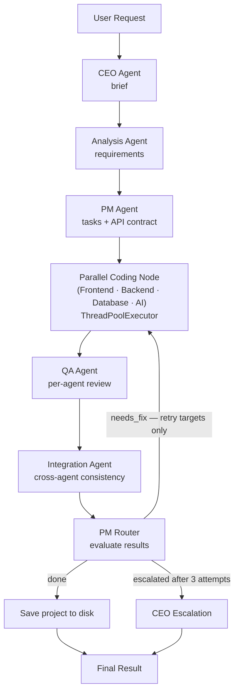

<div align="center">

# ⚒️ DevForge AI

**A stateful multi-agent system that turns a plain-language software request into a complete, working codebase — automatically planned, coded, reviewed, and fixed by a pipeline of specialized AI agents.**


[🐛 Report Bug](../../issues) · [💡 Request Feature](../../issues)

</div>

---

## What it does

You describe what you want in plain English — *"an e-commerce store with a login page and a shopping cart"* — and DevForge AI:

1. **Interprets** your request and produces a structured project brief
2. **Analyses** the brief to determine the feature list, tech stack, and whether an AI feature is genuinely needed
3. **Defines an API contract** — a shared list of agreed endpoint paths, methods, and shapes that every agent follows
4. **Splits** the work into one self-contained task per specialist agent, each carrying the API contract
5. **Generates** frontend, backend, and database (and optionally AI) code **in parallel**
6. **Reviews** each agent's output individually against its own task
7. **Checks cross-agent consistency** — verifies that the frontend calls the exact paths the backend defines, schema names match, and response shapes align
8. **Retries** only the agents that failed, feeding them their own previous output + specific QA / integration feedback
9. **Escalates** to a CEO summary message if an agent fails three times in a row
10. **Writes** the finished project to disk as real, organized files

You can drive DevForge AI either via the **CLI** (interactive terminal) or via its **REST API** — submit a job, poll its status, and retrieve the result when it's done.

Every decision is driven by the pipeline state — nothing is hardcoded per project type.

---

## Architecture



The **API contract** defined by the PM is embedded in every frontend and backend task, and passed to the Integration Agent as ground truth — so all agents share the same agreed endpoint paths from the start.

---

## Why certain decisions were made

**Why the PM defines an API contract before assigning tasks:**
without a shared contract, the frontend and backend independently invent endpoint paths and inevitably disagree. The PM now produces a canonical list of paths/methods/shapes *before* writing any task, then embeds it verbatim in both the frontend and backend tasks. The Integration Agent also receives this contract as its reference, eliminating the "who is right?" ambiguity.

**Why the backend is the authority on endpoint mismatches:**
when the integration check finds a path mismatch, only the frontend is asked to fix it — never both. Asking both sides to adjust simultaneously causes an oscillation loop where each agent corrects to a different path on every retry.

**Why parallel execution uses `ThreadPoolExecutor` instead of LangGraph fan-out:**
LangGraph's native superstep fan-out is real parallelism when the graph runner supports it, but on a single-threaded local Ollama setup the gain comes from overlapping the *HTTP wait time* between requests. Using an explicit `ThreadPoolExecutor` inside a single node gives the same overlap, keeps the graph topology simple (one node instead of four), and makes selective retry straightforward — only the agents in `retry_targets` are re-launched, not all four.

**Why QA reviews agents one at a time, not all together:**
reviewing the full codebase in a single call requires a huge context window. Reviewing each agent's output against just its own task keeps every call small — which matters especially when running on a local model with a limited context budget.

**Why the retry/escalation decision is plain Python, not an LLM:**
this is the one part of the system where a wrong or malformed response would be genuinely dangerous — it could loop forever or escalate incorrectly. Deterministic code can't hallucinate.

**Why only the failed agents re-run on retry:**
re-running the entire pipeline on a single agent's mistake throws away correct work and wastes compute. Only the agents that failed QA or the integration check get a new task — and that task includes their own previous output, so they fix specific problems instead of regenerating from scratch.

**Why the REST API runs the pipeline in a background task:**
code generation can take minutes. Blocking the HTTP request until the pipeline finishes is impractical — the connection would time out. Instead, `POST /generate` immediately returns a `job_id` (HTTP 202), and the pipeline runs in a FastAPI `BackgroundTask`. Clients poll `GET /status/{job_id}` and fetch the full result from `GET /result/{job_id}` when status is `done`.

---

## The LLM provider journey

This project didn't start on the setup it uses today — the model provider changed twice as real usage exposed real problems:

1. **Groq** (first choice) — chosen for speed. Ran into two issues: Groq deprecated the models the project was built on (`openai/gpt-oss-20b`, `openai/gpt-oss-120b`) with very little notice, and running Frontend/Backend/Database in parallel occasionally hit free-tier rate limits, causing an agent to return an empty response.
2. **Gemini** — tried next as a hosted alternative.
3. **Ollama, running locally** — the current setup. No rate limits, no surprise deprecations, full control over context size and output length. Two local models were tested:
   - **`qwen2.5:3b-instruct`** — fast and cheap to run, but too small to reliably generate multi-file code that fully covered every requested feature.
   - **`qwen2.5-coder:7b`** — a model specifically tuned for code, which produces noticeably more complete and correct output. The current default.

`config.py` keeps `GROQ_API_KEY` and `GOOGLE_API_KEY` in `.env.example` for anyone who wants to switch providers back — the model selection logic lives in one place, so swapping providers doesn't require touching any agent code.

---

## Tech stack

| Layer | Tools |
|---|---|
| Agent orchestration | LangGraph, LangChain |
| LLM | Ollama (local) via `langchain-ollama` |
| Default model | `qwen2.5-coder:7b` |
| Structured state | Python `TypedDict` with custom merge reducers |
| Parallel execution | `ThreadPoolExecutor` inside `parallel_coding_node` |
| REST API | FastAPI + Uvicorn |
| Job management | In-memory `JobStore` with thread-safe locking |
| Output | Files written to disk via `output_writer.py` |

Everything runs fully locally — no cloud API required once Ollama is set up.

---

## Project structure

```
devforge-ai/
├── src/
│   ├── graph/
│   │   ├── state.py                # ProjectState — shared across every agent
│   │   └── workflow.py             # LangGraph wiring: nodes, edges, routing + step logging
│   ├── agents/                     # Pure LLM logic — no LangGraph knowledge here
│   │   ├── ceo_agent.py
│   │   ├── analysis_agent.py
│   │   ├── pm_agent.py
│   │   ├── frontend_agent.py
│   │   ├── backend_agent.py
│   │   ├── database_agent.py
│   │   ├── ai_agent.py
│   │   ├── qa_agent.py
│   │   ├── integration_agent.py
│   │   └── escalation_agent.py
│   ├── nodes/                      # LangGraph wrappers — connect agents to state
│   │   ├── ceo_node.py
│   │   ├── analysis_node.py
│   │   ├── pm_node.py
│   │   ├── parallel_coding_node.py # Runs frontend/backend/database/ai in parallel threads
│   │   ├── qa_node.py
│   │   ├── integration_node.py
│   │   ├── pm_router_node.py
│   │   └── ceo_escalation_node.py
│   ├── api/                        # FastAPI REST layer
│   │   ├── app.py                  # FastAPI application factory
│   │   ├── routes.py               # Endpoints: /generate, /status, /result, /jobs, /health
│   │   ├── models.py               # Pydantic request / response models
│   │   └── job_store.py            # Thread-safe in-memory job registry
│   ├── prompts/                    # One system prompt per agent, versioned separately
│   ├── config.py                   # LLM provider + model selection, in one place
│   ├── utils.py                    # Shared JSON parsing and cleanup for LLM output
│   ├── output_writer.py            # Writes the finished project to disk
│   ├── server.py                   # Uvicorn entrypoint for the REST API
│   └── main.py                     # CLI entry point
├── pyproject.toml
├── .env.example
└── README.md
```

---

## Setup

```bash
git clone https://github.com/ebrahimzaher/devforge-ai
cd devforge-ai

python -m venv venv
venv\Scripts\activate        # Windows
# source venv/bin/activate   # macOS/Linux

pip install -e .

cp .env.example .env         # Windows: copy .env.example .env
```

Make sure Ollama is running locally and the model is pulled:

```bash
ollama pull qwen2.5-coder:7b
```

> **GPU note:** `qwen2.5-coder:7b` needs ~5 GB of VRAM. If your GPU has
> less (e.g. a 4 GB laptop card), either set `CUDA_VISIBLE_DEVICES=` in
> `.env` to force CPU mode, or switch `OLLAMA_MODEL` to
> `qwen2.5:3b-instruct` (`ollama pull qwen2.5:3b-instruct`), which runs
> comfortably in 2 GB.

Relevant environment variables (all in `config.py`, overridable via `.env`):

| Variable | Default | Purpose |
|----------|---------|---------:|
| `OLLAMA_BASE_URL` | `http://localhost:11434` | Where Ollama is running |
| `OLLAMA_MODEL` | `qwen2.5-coder:7b` | Model used by every agent |
| `OLLAMA_NUM_GPU` | `0` | Number of GPU layers (0 = CPU only) |
| `OLLAMA_HOME` | — | Override Ollama's home directory (e.g. a different drive) |
| `GROQ_API_KEY` | — | Only needed if you switch `config.py` back to Groq |
| `GOOGLE_API_KEY` | — | Only needed if you switch `config.py` back to Gemini |

---

## Usage

### CLI

```bash
python -m main
# or, via the entry point defined in pyproject.toml:
devforge
```

The console prints live progress for every step:

```
[Step 1] >>> CEO Agent          — writing project brief ...
[Step 1] <<< done in 16.1s

[Step 2] >>> Analysis Agent     — extracting requirements ...
[Step 2] <<< done in 19.2s

[Step 3] >>> PM Agent           — planning tasks & API contract ...
[Step 3] <<< done in 51.1s

[Step 4] >>> Coding Agents      — generating code (parallel) ...
[parallel_coding] initial — launching 3 agent(s) in parallel ...
  [parallel] [OK] frontend done
  [parallel] [OK] database done
  [parallel] [OK] backend done
[Step 4] <<< done in 87.3s
```

### REST API

Start the server:

```bash
devforge-server
# or directly:
python -m server
```

The API runs at `http://localhost:8000`. Interactive docs are available at [`http://localhost:8000/docs`](http://localhost:8000/docs).

#### Endpoints

| Method | Path | Description |
|--------|------|-------------|
| `GET` | `/health` | Health check |
| `POST` | `/generate` | Submit a new code generation job (returns `job_id` immediately, HTTP 202) |
| `GET` | `/status/{job_id}` | Poll job status (`pending` → `running` → `done` / `failed`) |
| `GET` | `/result/{job_id}` | Fetch the full result once the job is `done` |
| `GET` | `/jobs` | List all jobs |

#### Example flow

```bash
# 1 — Submit a job
curl -s -X POST http://localhost:8000/generate \
  -H "Content-Type: application/json" \
  -d '{"user_request": "a todo app with user authentication"}' | jq
# → { "job_id": "3fa85f64-...", "status": "pending" }

# 2 — Poll status
curl -s http://localhost:8000/status/3fa85f64-... | jq
# → { "job_id": "...", "status": "running", ... }

# 3 — Get result when done
curl -s http://localhost:8000/result/3fa85f64-... | jq
# → { "status": "done", "output_folder": "output/todo-app-...", "files_written": [...], ... }
```

---

On success, the project is written to disk under:

```
output/<project-name>-<timestamp>/
├── frontend/
├── backend/
├── database/
└── ai/            (only if an AI feature was needed)
```

Each folder also contains a `NOTES.md` the generating agent left about its own assumptions and limitations.

---

## Engineering notes

A few decisions worth calling out, since they came from real issues hit while building this:

- **The API contract is the single source of truth.** The PM generates a canonical list of endpoints before writing any task and embeds it verbatim in both the frontend and backend task descriptions. The Integration Agent also receives the contract as its reference — so mismatches are evaluated against a fixed ground truth, not inferred by comparing two moving targets.
- **Parallel execution cuts wall-clock time by 3–4×.** Frontend, backend, database, and AI agents all run simultaneously inside a single `ThreadPoolExecutor`. Since Ollama processes one request at a time locally, the speedup comes from overlapping the HTTP round-trip and queueing — each subsequent agent's request is already queued before the previous one finishes.
- **Selective retry avoids re-running correct agents.** `retry_targets` in the state carries only the agent names that failed. On re-entry, `parallel_coding_node` checks this list and skips agents that already passed — so a frontend fix doesn't re-generate a perfectly good database schema.
- **Endpoint mismatch resolution is unidirectional.** When the integration check detects a path mismatch, `pm_router_node` always targets the frontend — never the backend. This prevents the oscillation where both agents keep changing paths toward each other across retries.
- **LLM JSON output is unreliable at small model sizes.** `qwen2.5:3b-instruct` would sometimes produce string-concatenation patterns (`"..." \ "..."`) or bare backslashes inside JSON strings, both of which are invalid JSON. `utils.py` normalizes both before parsing — this made the 3B model usable where it would otherwise silently fail.
- **QA only evaluates against the original task, not accumulated fix notes.** After a retry, the task string includes the QA feedback from the previous attempt. If QA evaluated against the full string (including `--- Fix required ---` sections), it would keep finding the same "issues" in the fix notes themselves. Stripping everything after the first fix delimiter before passing to QA prevents false re-failures.
- **`generated_code` uses a merge reducer, not `keep_last`.** Multiple agents write to `generated_code` in the same superstep. Without a custom reducer, LangGraph would let each agent overwrite the others. The `merge_dicts` reducer merges at the top level so every agent's output survives the fan-in.
- **The REST API uses an in-memory `JobStore` with thread-safe locking.** Each job is stored as a `Job` dataclass. All reads and writes go through a `threading.Lock` so concurrent background tasks (one per submitted job) don't race each other. The store is intentionally in-memory — restarting the server clears all jobs.

---

## Current status

- [x] All agents implemented and wired together (CEO, Analysis, PM, Frontend, Backend, Database, AI, QA, Integration)
- [x] Shared API contract generated by PM and embedded in all agent tasks
- [x] Parallel Frontend / Backend / Database / AI execution via `ThreadPoolExecutor`
- [x] Live step-by-step progress logging with elapsed time
- [x] Per-agent QA review
- [x] Cross-agent integration check (endpoint paths, schema names, response shapes)
- [x] Selective retry — only failed agents are re-run
- [x] Unidirectional mismatch resolution (frontend adapts to backend, not both)
- [x] Previous-code forwarding on retry
- [x] PM-managed retry loop with a 3-attempt cap and CEO escalation
- [x] Output written to disk as real project files
- [x] FastAPI REST API (`POST /generate`, `GET /status/{id}`, `GET /result/{id}`, `GET /jobs`)
- [ ] Docker + Docker Compose support
- [ ] Automated tests for the generated project
- [ ] Self-consistency: generate N candidates, pick the best

---

## License

MIT