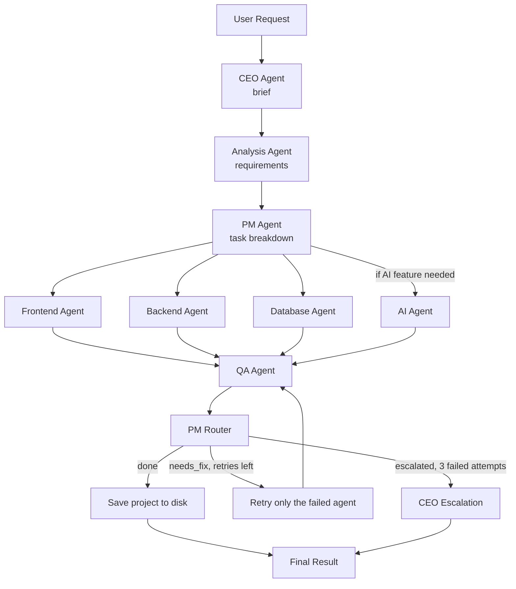

<div align="center">

# ⚒️ DevForge AI

**A stateful multi-agent system that turns a plain-language software request into a complete, working codebase — automatically planned, coded, reviewed, and fixed by a pipeline of specialized AI agents.**


[🐛 Report Bug](../../issues) · [💡 Request Feature](../../issues)

</div>

---

## What it does

You describe what you want in plain English — *"an e-commerce store with a login page and a shopping cart"* — and DevForge AI:

1. **Interprets** your request and produces a structured project brief
2. **Analyses** the brief to determine the feature list, tech stack, and whether an AI feature is genuinely needed
3. **Splits** the work into one self-contained task per specialist agent
4. **Generates** frontend, backend, database (and optionally AI) code in parallel
5. **Reviews** each agent's output individually against its own task
6. **Retries** only the agents that failed, feeding them their own previous output + the specific QA feedback
7. **Escalates** to a CEO summary message if an agent fails three times in a row
8. **Writes** the finished project to disk as real, organized files

Every decision is driven by the pipeline state — nothing is hardcoded per project type.

---

## Architecture



Every request goes through the same pipeline. Only the agents that
actually failed QA get re-run — the rest of the project is left alone.

---

## Why certain decisions were made

**Why QA reviews agents one at a time, not all together:**
reviewing the full codebase in a single call requires a huge context window. Reviewing each agent's output against just its own task keeps every call small — which matters especially when running on a local model with a limited context budget.

**Why the retry/escalation decision is plain Python, not an LLM:**
this is the one part of the system where a wrong or malformed response would be genuinely dangerous — it could loop forever or escalate incorrectly. Deterministic code can't hallucinate.

**Why only the failed agents re-run on retry:**
re-running the entire pipeline on a single agent's mistake throws away correct work and wastes compute. Only the agents that failed QA get a new task — and that task includes their own previous output, so they fix specific problems instead of regenerating from scratch.

---

## The LLM provider journey

This project didn't start on the setup it uses today — the model provider changed twice as real usage exposed real problems:

1. **Groq** (first choice) — chosen for speed. Ran into two issues: Groq deprecated the models the project was built on (`openai/gpt-oss-20b`, `openai/gpt-oss-120b`) with very little notice, and running Frontend/Backend/Database in parallel occasionally hit free-tier rate limits, causing an agent to return an empty response.
2. **Gemini** — tried next as a hosted alternative.
3. **Ollama, running locally** — the current setup. No rate limits, no surprise deprecations, full control over context size and output length. Two local models were tested:
   - **`qwen2.5:3b-instruct`** — fast and cheap to run, but too small to reliably generate multi-file code that fully covered every requested feature.
   - **`qwen2.5-coder:7b`** — a model specifically tuned for code, which produces noticeably more complete and correct output. The current default.

`config.py` keeps `GROQ_API_KEY` and `GOOGLE_API_KEY` in `.env.example` for anyone who wants to switch providers back — the model selection logic lives in one place, so swapping providers doesn't require touching any agent code.

---

## Tech stack

| Layer | Tools |
|---|---|
| Agent orchestration | LangGraph, LangChain |
| LLM | Ollama (local) via `langchain-ollama` |
| Default model | `qwen2.5-coder:7b` |
| Structured state | Python `TypedDict` with custom merge reducers |
| Parallel execution | LangGraph native superstep fan-out |
| Output | Files written to disk via `output_writer.py` |

Everything runs fully locally — no cloud API required once Ollama is set up.

---

## Project structure

```
devforge-ai/
├── src/
│   ├── graph/
│   │   ├── state.py        # ProjectState — shared across every agent
│   │   └── workflow.py     # LangGraph wiring: nodes, edges, routing logic
│   ├── agents/             # Pure LLM logic — no LangGraph knowledge here
│   │   ├── ceo_agent.py
│   │   ├── analysis_agent.py
│   │   ├── pm_agent.py
│   │   ├── frontend_agent.py
│   │   ├── backend_agent.py
│   │   ├── database_agent.py
│   │   ├── ai_agent.py
│   │   ├── qa_agent.py
│   │   └── escalation_agent.py
│   ├── nodes/              # LangGraph wrappers — connect agents to state
│   │   ├── ceo_node.py
│   │   ├── analysis_node.py
│   │   ├── pm_node.py
│   │   ├── frontend_node.py
│   │   ├── backend_node.py
│   │   ├── database_node.py
│   │   ├── ai_node.py
│   │   ├── qa_node.py
│   │   ├── pm_router_node.py
│   │   └── ceo_escalation_node.py
│   ├── prompts/            # One system prompt per agent, versioned separately
│   ├── config.py           # LLM provider + model selection, in one place
│   ├── utils.py            # Shared JSON parsing and cleanup for LLM output
│   ├── output_writer.py    # Writes the finished project to disk
│   └── main.py             # Entry point
├── pyproject.toml
├── .env.example
└── README.md
```

---

## Setup

```bash
git clone https://github.com/ebrahimzaher/devforge-ai
cd devforge-ai

python -m venv venv
venv\Scripts\activate        # Windows
# source venv/bin/activate   # macOS/Linux

pip install -e .

cp .env.example .env         # Windows: copy .env.example .env
```

Make sure Ollama is running locally and the model is pulled:

```bash
ollama pull qwen2.5-coder:7b
```

> **GPU note:** `qwen2.5-coder:7b` needs ~5 GB of VRAM. If your GPU has
> less (e.g. a 4 GB laptop card), either set `CUDA_VISIBLE_DEVICES=` in
> `.env` to force CPU mode, or switch `OLLAMA_MODEL` to
> `qwen2.5:3b-instruct` (`ollama pull qwen2.5:3b-instruct`), which runs
> comfortably in 2 GB.

Relevant environment variables (all in `config.py`, overridable via `.env`):

| Variable | Default | Purpose |
|----------|---------|---------:|
| `OLLAMA_BASE_URL` | `http://localhost:11434` | Where Ollama is running |
| `OLLAMA_MODEL` | `qwen2.5-coder:7b` | Model used by every agent |
| `OLLAMA_HOME` | — | Override Ollama's home directory (e.g. a different drive) |
| `GROQ_API_KEY` | — | Only needed if you switch `config.py` back to Groq |
| `GOOGLE_API_KEY` | — | Only needed if you switch `config.py` back to Gemini |

---

## Usage

```bash
python -m main
# or, via the entry point defined in pyproject.toml:
devforge
```

The console prints the brief, requirements, tasks, generated code snippets, QA report, and final status. On success, the project is written to disk under:

```
output/<project-name>-<timestamp>/
├── frontend/
├── backend/
├── database/
└── ai/            (only if an AI feature was needed)
```

Each folder also contains a `NOTES.md` the generating agent left about its own assumptions and limitations.

---

## Engineering notes

A few decisions worth calling out, since they came from real issues hit while building this:

- **Parallel execution is real, not simulated.** LangGraph runs independent nodes in the same superstep and automatically waits for all of them before the next node fires — no manual synchronization code needed.
- **LLM JSON output is unreliable at small model sizes.** `qwen2.5:3b-instruct` would sometimes produce string-concatenation patterns (`"..." \ "..."`) or bare backslashes inside JSON strings, both of which are invalid JSON. `utils.py` normalizes both before parsing — this made the 3B model usable where it would otherwise silently fail.
- **QA only evaluates against the original task, not accumulated fix notes.** After a retry, the task string includes the QA feedback from the previous attempt. If QA evaluated against the full string (including `--- Fix required ---` sections), it would keep finding the same "issues" in the fix notes themselves. Stripping everything after the first fix delimiter before passing to QA prevents false re-failures.
- **`generated_code` uses a merge reducer, not `keep_last`.** Multiple agents write to `generated_code` in the same superstep. Without a custom reducer, LangGraph would let each agent overwrite the others. The `merge_dicts` reducer merges at the top level so every agent's output survives the fan-in.

---

## Current status

- [x] All 9 agents implemented and wired together
- [x] Parallel Frontend / Backend / Database (+ conditional AI) execution
- [x] Per-agent QA review
- [x] PM-managed retry loop with a 3-attempt cap and CEO escalation
- [x] Previous-code forwarding on retry
- [x] Output written to disk as real project files
- [ ] FastAPI REST API (`POST /generate`, `GET /status/{id}`)
- [ ] Docker + Docker Compose support
- [ ] Cross-agent consistency check (Frontend ↔ Backend ↔ Database API contract)
- [ ] Automated tests for the generated project
- [ ] Self-consistency: generate N candidates, pick the best (especially useful for Backend/Database where small-model mistakes matter most)

---

## License

MIT